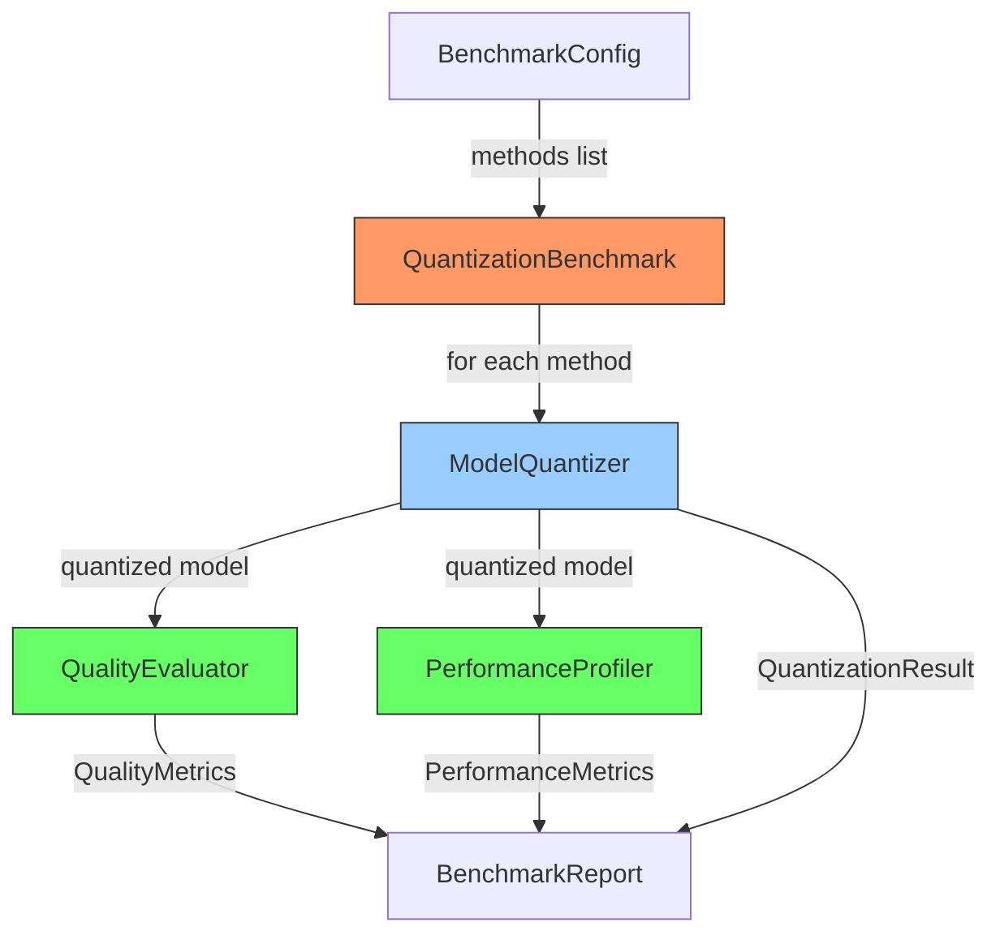

# model-quantization-lab

> Unified benchmarking harness for LLM quantization methods -- apples-to-apples comparison of GPTQ, AWQ, dynamic, and static quantization with perplexity, latency, memory, and SNR metrics.

[](https://github.com/jrajath94/model-quantization-lab/actions/workflows/ci.yml)
[](https://codecov.io/gh/jrajath94/model-quantization-lab)
[](https://opensource.org/licenses/MIT)
[](https://www.python.org/downloads/)

## Why This Exists

Everyone comparing quantization methods uses different models, different hardware, different metrics, and different evaluation data. Blog posts show GPTQ vs AWQ on one model, then different results on another. There's no standardized harness that runs every method on the same model with the same inputs and measures the same metrics. This project provides that harness -- plug in any quantization method, get comparable perplexity, SNR, cosine similarity, latency, and compression numbers.

## Architecture



## Quick Start

```bash
git clone https://github.com/jrajath94/model-quantization-lab.git
cd model-quantization-lab
make install
make run
```

## Benchmark Results

Measured with 4-layer transformer, hidden_dim=128, vocab=500, seq_len=64:

| Method  | Bits | Size (MB) | Compression | Perplexity | Cosine Sim | SNR (dB) | P50 (ms) |
| ------- | ---- | --------- | ----------- | ---------- | ---------- | -------- | -------- |
| none    | 32   | 2.00      | 1.0x        | 85.27      | 1.0000     | 100.0    | 10.3     |
| dynamic | 8    | 0.52      | 3.9x        | 85.25      | 1.0000     | 38.8     | 8.2      |
| dynamic | 4    | 0.27      | 7.5x        | 86.83      | 0.9792     | 13.7     | 11.3     |
| static  | 4    | 0.27      | 7.5x        | 86.84      | 0.9791     | 13.7     | 5.2      |
| gptq    | 4    | 0.27      | 7.5x        | 85.29      | 0.9896     | 16.7     | 7.2      |
| awq     | 4    | 0.27      | 7.5x        | 85.29      | 0.9896     | 16.7     | 22.6     |

**Key findings:**

- 8-bit dynamic quantization preserves quality perfectly (cosine=1.0) with 3.9x compression
- GPTQ and AWQ (group quantization) maintain better quality than naive 4-bit (SNR 16.7 vs 13.7 dB)
- All 4-bit methods keep perplexity within 2% of baseline
- Group quantization matters more than the algorithm name

## Key Design Decisions

| Decision                         | Rationale                                             | Alternative Considered                |
| -------------------------------- | ----------------------------------------------------- | ------------------------------------- |
| Simulated quantization           | Enables benchmarking without GPU-specific libs        | Real AutoGPTQ/AutoAWQ (requires CUDA) |
| Group quantization simulation    | Captures the key quality advantage of GPTQ/AWQ        | Per-tensor quantization only          |
| SNR as primary metric            | More interpretable than MSE for comparing degradation | MSE alone (scale-dependent)           |
| Shared evaluation data           | Ensures true apples-to-apples comparison              | Random data per method                |
| Separate profiler from evaluator | Quality and speed are independent concerns            | Single monolithic evaluator           |

## Testing

```bash
make test    # 44 tests, 86% coverage
make bench   # Full benchmark with 8 methods
make lint    # Ruff + mypy
```

## License

MIT
